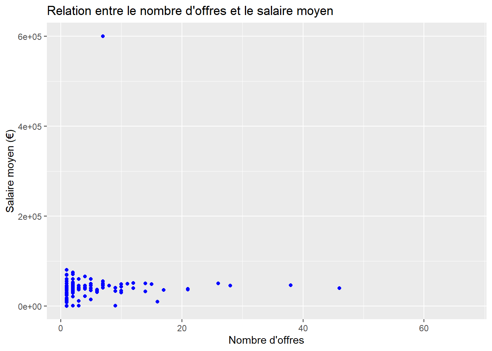

---

### **3. `analysis.Rmd`**
This page provides the detailed data analysis and visualizations.

```markdown
---
title: "Analyse des Données"
output: html_document
---

# Analyse des Données

Cette page explore les relations entre l'innovation des entreprises et la demande de compétences en data science.

## Relation entre Innovation et Salaire Moyen


```
## Warning: le package 'ggplot2' a été
## compilé avec la version R 4.4.2
```

```
## Warning: le package 'wordcloud' a été
## compilé avec la version R 4.4.2
```

```
## Le chargement a nécessité le package : RColorBrewer
```


```
## Warning: Removed 596 rows containing missing values
## or values outside the scale range
## (`geom_point()`).
```



``` r
install.packages(c("rmarkdown", "knitr", "dplyr", "ggplot2", "kableExtra", "tidyr", "readr", "lubridate", "scales"))
```

```
## Error in install.packages : Updating loaded packages
```

``` r
library(rmarkdown)
library(knitr)
library(dplyr)
library(ggplot2)


# Charger la base de données
base_brevets <- readRDS("data/base_brevets.rds")

# Statistiques descriptives pour les variables numériques
brevets_stats <- base_brevets %>%
  summarize(
    min_n_patents = min(n_patents, na.rm = TRUE),
    median_n_patents = median(n_patents, na.rm = TRUE),
    max_n_patents = max(n_patents, na.rm = TRUE),
    mean_n_patents = mean(n_patents, na.rm = TRUE),
    sd_n_patents = sd(n_patents, na.rm = TRUE),
    na_n_patents = sum(is.na(n_patents))
  )

# Afficher les résultats
kable(brevets_stats)
```


| min_n_patents| median_n_patents| max_n_patents| mean_n_patents| sd_n_patents| na_n_patents|
|-------------:|----------------:|-------------:|--------------:|------------:|------------:|
|             1|                4|         14788|       27.72348|     273.4046|            0|

``` r
# Top 5 firm_name par nombre de brevets
top_firms <- base_brevets %>%
  group_by(firm_name) %>%
  summarize(total_patents = sum(n_patents, na.rm = TRUE)) %>%
  arrange(desc(total_patents)) %>%
  head(5)

kable(top_firms)
```


|firm_name                                           | total_patents|
|:---------------------------------------------------|-------------:|
|commissariatlnergieatomiqueetauxnergiesalternatives |         14788|
|alcatellucent                                       |         10640|
|centrenationaldelarecherchescientifique             |          9361|
|thomsonlicensing                                    |          8824|
|centrenationaldelarecherchescientifiquecnrs         |          7401|
